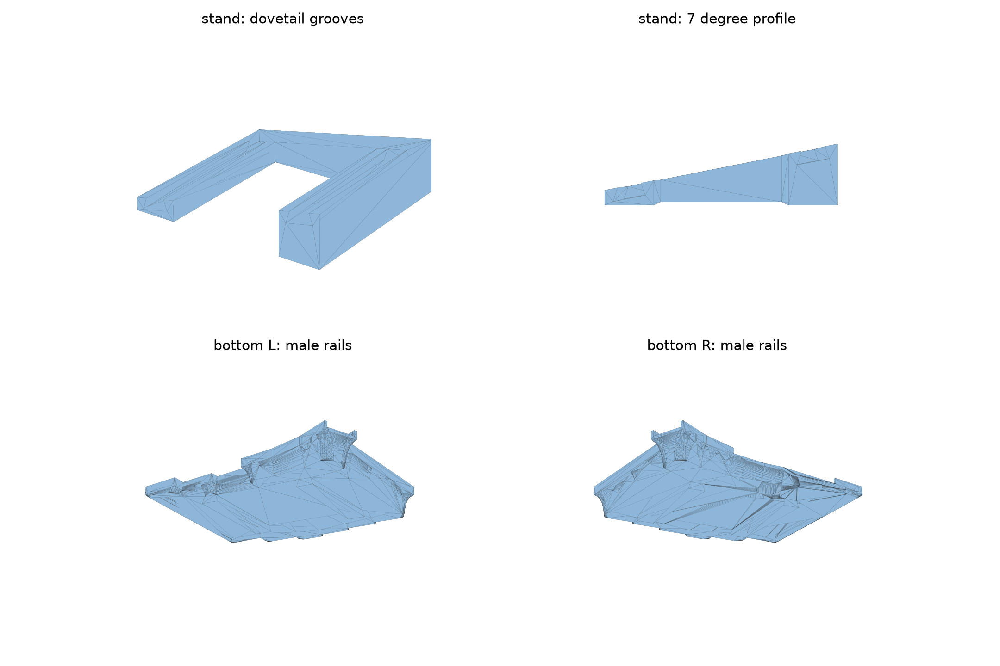

# roBa v3 着脱式テンティングスタンド

roBa v3 の左右ボトムプレートにダブテールレールを一体化し、7°のスタンドを前後方向へスライド着脱できる派生モデルです。接着剤や追加ネジは使いません。原本の `bottom_L.stp` / `bottom_R.stp` は変更していません。



## 構成

- `generated/roBa_v3_bottom_L_dovetail.*`: 左ボトム＋オスレール2本
- `generated/roBa_v3_bottom_R_dovetail.*`: 右ボトム＋オスレール2本
- `generated/roBa_v3_tenting_stand_7deg.*`: 左右共通スタンド（2個造形）

スタンドは机側が平面で、ボトム受け面が7°です。2本の縦桟にメス溝があり、開いている側からボトムのレールを差し込みます。反対側の横桟がストッパーになります。

## コネクタ寸法

- オスレール: 長さ48 mm、根元7 mm、先端10 mm、高さ2.4 mm
- レール間隔: 中心間60 mm
- メス溝: 左右それぞれ0.25 mmのクリアランス
- 深さ方向のクリアランス: 0.25 mm
- スタンド外形: 76 mm × 72 mm
- 高さ: 外側3.0 mm、内側約12.3 mm

クリアランスはFDM造形の初期値です。プリンタによってきつい場合は `DOVETAIL_CLEARANCE` を0.30〜0.40 mmへ増やしてください。緩い場合は0.15〜0.20 mmへ減らします。

## 取り付け

1. 左右それぞれ、原本ボトムの代わりにコネクタ付きボトムを使用します。
2. スタンドの低い側をキーボード外側、高い側を中央側へ向けます。
3. スタンドの開いている側から、ボトムの2本のレールを同時に差し込みます。
4. レール端が奥のストッパーへ当たるまで押し込みます。
5. 取り外すときは、左右のレールを平行に保ったまま差し込み方向と逆へ引き抜きます。

片方だけを先に強く押すと噛み込みや積層割れの原因になります。初回は無理に押し込まず、バリや象の足を除去してから嵌合を確認してください。

## 造形の目安

- スタンド: 机に接する平面を下、サポートなし
- 積層ピッチ: 0.2 mm以下
- 壁: 3周以上
- インフィル: 20〜30%
- 材料: 試作はPETG推奨。PLAの場合は高温環境での変形に注意

コネクタ付きボトムは形状が複雑なため、使用するスライサーでレール根元と既存ケースのオーバーハングを確認してください。

## 再生成・検証

Python 3.12 と CadQuery 2.8 で生成しています。

```powershell
python .\case\v3\tenting_stand\tenting_stand.py
python .\case\v3\tenting_stand\verify_mesh.py
```

生成時にBRep妥当性、ソリッド数、体積、外形寸法、材料点・空隙点を検査します。さらに、装着位置でオス・メスが干渉しないことと、0.2 mm押し込み過ぎた位置でストッパーが接触することを形状演算で確認します。結果は `generated/*.verified.json` に保存します。

## 未確認事項

- 実機での着脱荷重、がたつき、繰り返し耐久性
- 実際の3Dプリンタ・スライサーでの造形確認
- 長時間使用時のたわみと滑り
